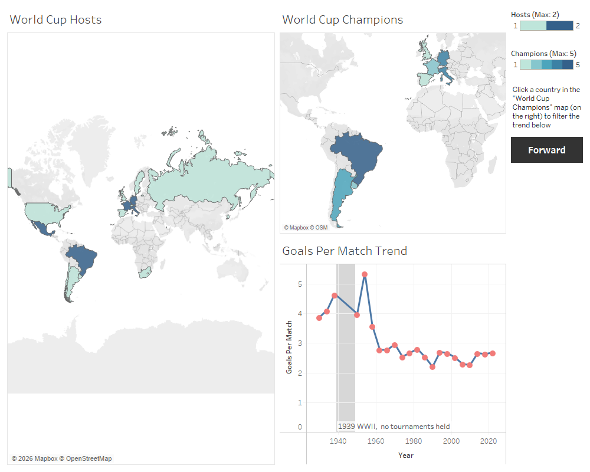
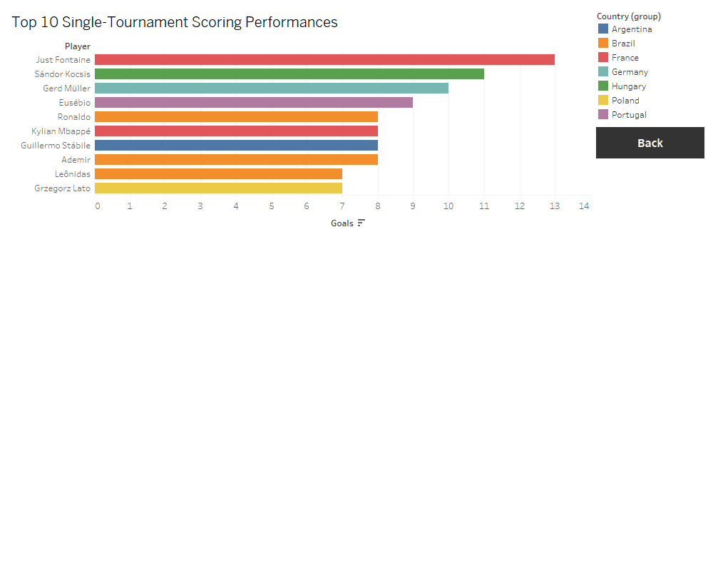

# FIFA World Cup History Dashboard (Tableau)
 
A two-page interactive Tableau dashboard exploring 96 years of FIFA World Cup history — hosts, champions, scoring trends, and individual tournament performances — built on top of an Excel-based data cleaning and validation workflow.

**Dashboard 1 — Hosts, Champions & Scoring Trend**

 
**Dashboard 2 — Top Individual Performances**

 
## Project overview
 
This project explores the [FIFA World Cup Complete Dataset, 1930-2026](https://www.kaggle.com/datasets/kulkarniparth09/fifa-world-cup-complete-dataset-19302026), covering all 22 completed editions plus reference data for the 2026 tournament. The goal was to clean and validate the data in Excel, then build an interactive Tableau dashboard exploring:
 
- Which countries have hosted, and which have actually won?
- How has scoring (goals per match) changed across nearly a century of football?
- Who has produced the best single-tournament scoring performances in World Cup history?
This was also a first project in Tableau, after three prior projects in Excel/Power BI (chosen specifically to show range across BI tools, not just within one).
 
## Tools used
 
- **Excel** — data cleaning, date-bug fixes, cross-sheet validation
- **Tableau Desktop** — relationships, geographic mapping, filter actions, dashboard navigation

## Process & data issues caught
 
1. **Date corruption bug.** The `start_date`/`end_date` columns in `wc_all_editions` had lost their year component on import — every single date showed 2026 regardless of the actual tournament year (a classic "month-day-only text defaulting to current year" Excel quirk). Fixed by reconstructing the date using `DATE(year, MONTH(date), DAY(date))`, pulling the correct year from the reliable `year` column.
2. **Curated vs. complete match data.** `wc_all_matches` contains only a curated subset of notable matches (184 rows) rather than the full historical match record (which exceeds 900 matches across 22 editions) — confirmed by cross-checking match/goal counts against `wc_all_editions`' own totals, which didn't match. Aggregate stats in this dashboard are sourced from `wc_all_editions`, not `wc_all_matches`.
3. **Country naming inconsistencies.** "West Germany" needed to be grouped with "Germany" across three separate fields (Host, Champion, and Top Scorer Country) to avoid splitting Germany's historical totals across two map colors / legend entries.
4. **Wrong source field.** Kylian Mbappé initially appeared with 172 goals in the Top Scorers chart, caused by the chart referencing the wrong underlying field for "Goals," which summed across the wrong set of rows. Caught by sanity-checking the number against the real all-time single-tournament record (13, held by Just Fontaine) and fixed by pointing the chart at the correct field.
5. **Chart scope clarity.** The "Top Scorers" chart shows the best **single-tournament** Golden Boot tally per edition, not career totals. This matters because: Miroslav Klose, the long-standing #2 all-time career scorer (16 goals across four tournaments, 2002–2014), never won a single edition's Golden Boot by a wide enough margin to appear in a top-10-by-edition chart, since his individual tournament tallies (5, 5, 4, 2) never topped that year's best. This is a genuine scoping distinction, not an error, and the chart is titled accordingly.

## A note on timing
 
This dashboard's source data runs through the 2022 World Cup. The 2026 tournament was live and in progress while this project was being built, and the all-time career scoring record was actually broken during that window: Lionel Messi passed Klose's long-standing record of 16 to reach 18 career goals, and Kylian Mbappé tied Klose's 16, both as of June 22, 2026. Neither shows up in this dashboard's historical data, but it's a good example of why "best single tournament" and "career total" are genuinely different stats worth keeping separate.
 
## Key insights
 
- **Goals per match peaked in 1954** (5.38 goals/match) and have generally declined since, settling into a more defensively-organized modern era (2.2–2.8 goals/match in recent decades).
- **Brazil leads in titles (5)** but has only hosted once (1958 was away; 1950 they hosted but lost the final). Title success and home advantage aren't tightly linked for football's most successful nation.
- **Mexico, Brazil, Germany/France/Italy** are the only multi-time hosts in World Cup history.
- **Just Fontaine's 13 goals in 1958** remains the all-time single-tournament scoring record, more than 65 years on.

## Interactive features
 
- Clicking a country on either the Host map or Champion map filters the Goals Per Match trend line to that country's relevant years, using a two-way Tableau filter action.
- A grayed reference band marks 1939–1949, when no World Cups were held due to WWII.
- Navigation buttons link between the two dashboard pages.
## Files in this repo
 
| File | Description |
|---|---|
| `WorldCup_History_Tableau.twbx` | Packaged Tableau workbook (includes the data source) |
| `WorldCup_Cleaned_Data.xlsx` | Cleaned, validated source data across all five sheets |
| `screenshots/` | Static exports of both dashboard pages |
 
## Possible next steps
 
- Update the dataset through the live 2026 tournament once it concludes, to capture the new Messi/Mbappé scoring records
- Rebuild `wc_all_matches` from a complete match-history source to enable real match-level analysis rather than a curated subset
- Add a "career totals" view by aggregating top-scorer-style data across multiple tournaments per player, to properly surface players like Klose who excelled across editions rather than within one
